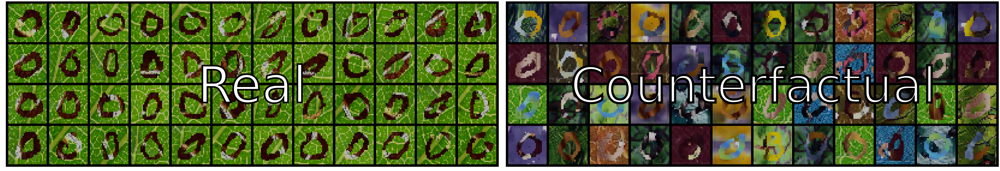
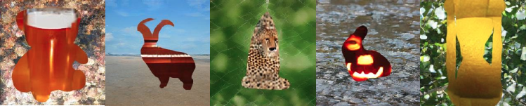

# Counterfactual Generative Networks #

#### [[Project]](https://sites.google.com/view/counterfactual-generation/home) [[PDF]](https://openreview.net/pdf?id=BXewfAYMmJw) [[Blog]](https://autonomousvision.github.io/cgn/) [[Music Video]](https://youtu.be/JDwaLueR35U) [[Colab]](https://colab.research.google.com/gist/xl-sr/ad93d3918e456fd4cd4aabdcaad87148/generating_counterfactuals.ipynb)


This repository contains the code for the ICLR 2021 paper "Counterfactual Generative Networks" by [Axel Sauer](https://axelsauer.com/) and [Andreas Geiger](http://www.cvlibs.net/).
If you want to take the CGN for a spin and generate counterfactual images, you can try out the Colab below.

[](https://colab.research.google.com/gist/xl-sr/ad93d3918e456fd4cd4aabdcaad87148/generating_counterfactuals.ipynb) <br>

If you find our code or paper useful, please cite
```bibtex
@inproceedings{Sauer2021ICLR,
 author =  {Axel Sauer, Andreas Geiger},
 title = {Counterfactual Generative Networks},
 booktitle = {International Conference on Learning Representations (ICLR)},
 year = {2021}}
```

## Setup ##
Install anaconda (if you don't have it yet)
```Shell
wget https://repo.anaconda.com/archive/Anaconda3-2020.11-Linux-x86_64.sh
bash Anaconda3-2020.11-Linux-x86_64.sh
source ~/.profile
```

Clone the repo and build the environment

```Shell
git clone https://github.com/autonomousvision/counterfactual_generative_networks
cd counterfactual_generative_networks
conda env create -f environment.yml
conda activate cgn
```

Make all scripts executable: ```chmod +x  scripts/*```. Then, download the datasets (colored MNIST, Cue-Conflict, IN-9) and the pre-trained weights (CGN, U2-Net). Comment out the ones you don't need.

```Shell
./scripts/download_data.sh
./scripts/download_weights.sh
```

## MNISTs ##


The main functions of this sub-repo are:
- Generating the MNIST variants
- Training a CGN
- Generating counterfactual datasets
- Training a shape classifier

### Train the CGN ###

We provide well-working configs and weights in ```mnists/experiments```. To train a CGN on, e.g., Wildlife MNIST, run

```Shell
python mnists/train_cgn.py --cfg mnists/experiments/cgn_wildlife_MNIST/cfg.yaml
```
For more info, add `--help`. Weights and samples will be saved in ```mnists/experiments/```.

### Generate Counterfactual Data ###

To generate the counterfactuals for, e.g., double-colored MNIST, run

```Shell
python mnists/generate_data.py \
--weight_path mnists/experiments/cgn_double_colored_MNIST/weights/ckp.pth \
--dataset double_colored_MNIST --no_cfs 10 --dataset_size 100000
```

Make sure that you provide the right dataset together with the weights. You can adapt the weight-path to use your own weights. The command above generates ten counterfactuals per shape.

### Train the Invariant Classifier ###

 The classifier training uses Tensor datasets, so you need to save the non-counterfactual datasets as tensors.
 For DATASET = {colored_MNIST, double_colored_MNIST, wildlife_MNIST}, run

```Shell
python mnists/generate_data.py --dataset DATASET
```

To train, e.g., a shape classifier (invariant to foreground and background) on wildlife MNIST, run,

```Shell
python mnists/train_classifier.py --dataset wildlife_MNIST_counterfactual
```

Add ```--help``` for info on the available options and arguments. The hyperparameters are unchanged for all experiments.

## ImageNet ##

The main functions of this sub-repo are:
- Training a CGN
- Generating data (samples, interpolations, or a whole dataset)
- Training an invariant classifier ensemble

### Train the CGN ###


Run

```Shell
python imagenet/train_cgn.py --model_name MODEL_NAME
```
The default parameters should give you satisfactory results. You can change them in ```imagenet/config.yml```. For more info, add `--help`. Weights and samples will be saved in ```imagenet/data/MODEL_NAME```.

### Generate Counterfactual Data ###


__Samples__. To generate a dataset of counterfactual images, run

```Shell
python imagenet/generate_data.py --mode random --weights_path imagenet/weights/cgn.pth \
--n_data 100 --weights_path imagenet/weights/cgn.pth --run_name RUN_NAME \
--truncation 0.5 --batch_sz 1
```

The results will be saved in ```imagenet/data```. For more info, add ```--help```. If you want to save only masks, textures, etc., you need to change this directly in the code (see line 206).


The labels will be stored in a csv file. You can read them as follows:
```Python
import pandas as pd
df = pd.read_csv(path, index_col=0)
df = df.set_index('im_name')
shape_cls = df['shape_cls']['RUN_NAME_0000000.png']
```
__Generating a dataset to train a classfier__. Produce one dataset with ```--run_name train```, the other
one with ``` --run_name val```. If you have several GPUs available, you can index the name, e.g., ```--run_name
train_GPU_NUM```. The class ```ImagenetCounterfactual``` will glob all these datasets and generate a single, big
training set. Make sure to set ```--batch_sz 1```. With a larger batch size, a batch will be saved as a single png; this is useful for visualization, not for training.

__Interpolations__. To generate interpolation sheets, e.g., from a barn (425) to whale (147), run

```Shell
python imagenet/generate_data.py --mode fixed_classes \
--n_data 1 --weights_path imagenet/weights/cgn.pth --run_name barn_to_whale \
--truncation 0.3 --interp all --classes 425 425 425 --interp_cls 147 --save_noise
```

You can also do counterfactual interpolations, i.e., interpolating only over, e.g., shape, by setting `--interp shape`. 

__Interpolation Gif__. To generate a gif like in the teaser (Sample an image of class $1, than interpolate to shape $2, then background $3, then shape $4, and finally back to $1), run
```Shell
./scripts/generate_teaser_gif.sh 992 293 147 330
```
The positional arguments are the classes, see [imagenet labels](https://gist.github.com/yrevar/942d3a0ac09ec9e5eb3a) for the available options.

### Train the Invariant Classifier Ensemble ###
__Training__. First, you need to make sure that you have all datasets in ```imagenet/data/```. Download Imagenet, e.g., from [Kaggle](https://www.kaggle.com/c/imagenet-object-localization-challenge/data), produce a counterfactual dataset (see above), and download the Cue-Conflict and BG-Challenge dataset (via the download script in ```scripts```).

To train a classifier on a single GPU with a pre-trained Resnet-50 backbone, run
```Shell
python imagenet/train_classifier.py -a resnet50 -b 32 --lr 0.001 -j 6 \
--epochs 45 --pretrained --cf_data CF_DATA_PATH --name RUN_NAME
```
Again, add ```--help``` for more information on the possible arguments.

__Distributed Training__. To switch to multi-GPU training, run ```echo $CUDA_VISIBLE_DEVICES``` to see if the GPUs are visible. In the case of a
single node with several GPUs, you can run, e.g.,
```Shell
python imagenet/train_classifier.py -a resnet50 -b 256 --lr 0.001 -j 6 \
--epochs 45 --pretrained --cf_data CF_DATA_PATH --name RUN_NAME \
--rank 0 --multiprocessing-distributed --dist-url tcp://127.0.0.1:8890 --world-size 1
```
If your setup differs, e.g., several GPU machines, you need to adapt the rank and world size.

__Visualization__. To visualize the Tensorboard outputs, run ```tensorboard --logdir=imagenet/runs``` and open the local address in your browser.

## Acknowledgments ##
We like to acknowledge several repos of which we use parts of code, data, or models in our implementation:

- colored MNIST by [feidfoe](https://github.com/feidfoe/learning-not-to-learn)
- pre-trained BigGAN by [huggingface](https://github.com/huggingface/pytorch-pretrained-BigGAN)
- U2-Net by [NathanUA](https://github.com/NathanUA/U-2-Net/)
- Imagenet training by and with [pytorch](https://github.com/pytorch/examples/tree/master/imagenet)
- Style-vs-Shape evaluation by [rgeirhos](https://github.com/rgeirhos/texture-vs-shape)
- BG-Gap evaluation by [MadryLab](https://github.com/MadryLab/backgrounds_challenge)
